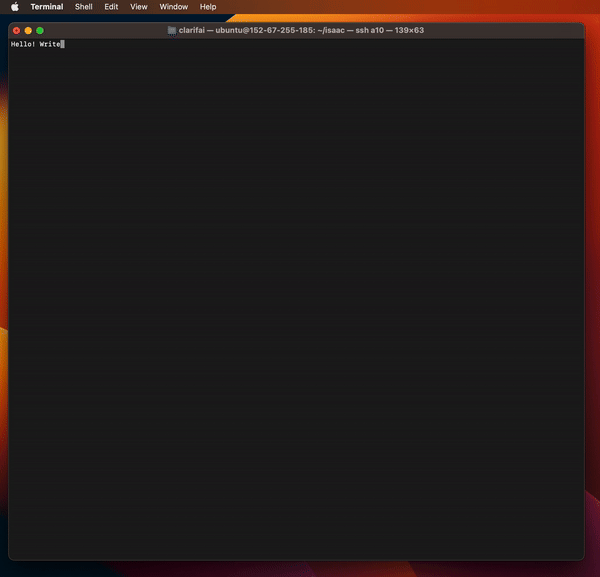
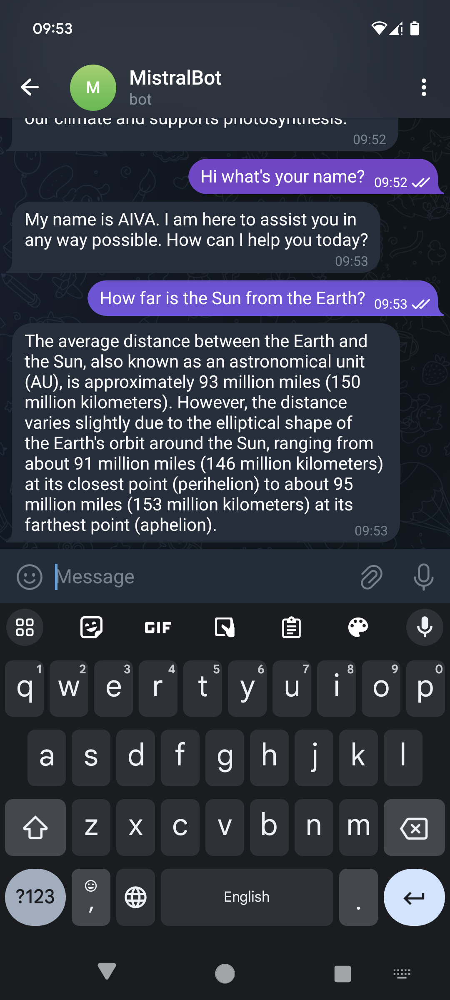

# llama-cpp-python-chat

[](https://www.python.org)
[](https://opensource.org/licenses/MIT)

<div align="center">
    
    
</div>

Chat tools powered by the [llama-cpp-python](https://github.com/abetlen/llama-cpp-python) library. Made for a [PyCon LT 2024 Talk](https://pycon.lt/2024/talks/DHBLXW). This repository provides:
- [a Command Line Chat](#command-line-chat): A chat bot that runs on the command line interface. Outputs are streamed so that you're able to see the "typing in real time" experience.
- [a Telegram Bot](#telegram-bot): A chat bot on Telegram.

## Prerequisites
For either application, we need the same model and similar dependencies.

Use the command line to download the model and the libraries. 
1. On a linux machine, run
```
pip3 install -r requirements.txt
```
2. Download an individual model file from huggingface. You do not need a HF account to run this.
```
huggingface-cli download TheBloke/CapybaraHermes-2.5-Mistral-7B-GGUF capybarahermes-2.5-mistral-7b.Q4_K_M.gguf --local-dir . --local-dir-use-symlinks False
```
> [!NOTE]  
> Offloading to GPU requires installing with BLAS.

## Command Line Chat
In the root directory of the repo, run
```
python run_chat.py
```
To enable verbose outputs, set the number of threads, use the flags
```
python run_chat.py --verbose --n_threads 12
```
Once it is up and running, start chatting with it by directly typing your prompt and hit `Enter`. Chat state is managed under the hood. 

### Special Commands
- `bye`: Ends the chat and also the program.
- `clear`: Clear chat history.


## Telegram Bot
A telegram bot powered by [llama-cpp-python](https://github.com/abetlen/llama-cpp-python).

### 1. Telegram Setup
1. Follow the steps to [obtain an API TOKEN from @BotFather](https://core.telegram.org/bots#botfather). 
2. Set the token as an environment variable
```
export TELEGRAM_BOT_TOKEN=YOUR_TOKEN
```

### 2. Running the bot
In the root directory of the repo, run
```
python start_telegram_bot.py
```

## Limitations
Currently the server from python bindings do not support batched inference nor concurrent requests.